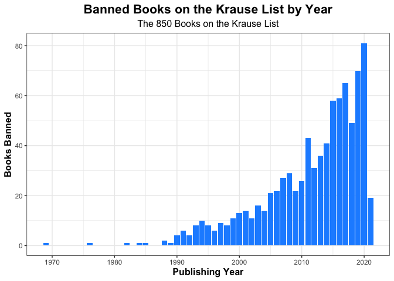
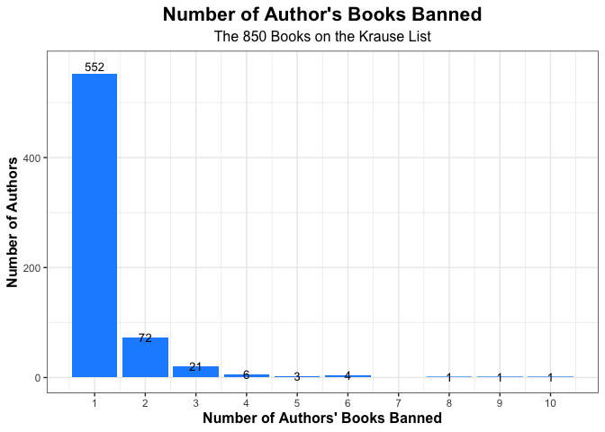

Texas Banned Books (Krause List)
================
Damon Neanover
2/20/2022

## Texas’ Banned Books

Recently Texas has been in the news the controversial practice of
banning books. This is an analysis of the common themes being banned in
each of the books. Attached to this repo are two versions of the banned
books, one PDF and on XLSX. This list can also be accessed
[here](https://static.texastribune.org/media/files/94fee7ff93eff9609f141433e41f8ae1/krausebooklist.pdf).

### By Year and Author

#### By Year

Below is a look at the distribution of the banned books by year.

The data shows that Krause is primarily concerned with books that were
published in the last decade, with 578 (68%) of the books published in
2010 or later. Only two books were banned before 1980, one from the 60s
by Michael Crichton, and the other from the 70s by Andrea Boroff Eagan.

#### By Author

We’ve shown there is a bias towards banning newer books. Could there be
a bias towards specific authors?

There are 661 authors represented on this list, with 552 (83.5%) having
only one book banned.
